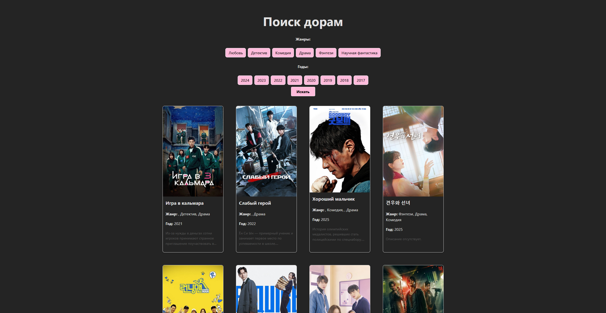

# Dorama Search App

## О проекте

Это веб-приложение для поиска дорам по жанрам и году выпуска. Проект был создан для изучения основ **React** и работы с внешним API. Приложение позволяет пользователям просматривать каталог корейских дорам и фильтровать их.

---

## Используемые технологии

* **React**
* **JavaScript (ES6+)**
* **Axios**
* **The Movie Database (TMDb) API** 

---

## Функционал

Приложение на текущий момент умеет:

* Отображать список популярных дорам на главной странице.
* Фильтровать дорамы по **жанру** (Любовь, Комедия, Драма и т.д.).
* Фильтровать дорамы по **году выпуска**.
* Выводить карточки с постерами, названием, жанром и годом.
* Отображать состояние загрузки и ошибки.

---

## Будущие планы

В следующих версиях проекта планируется реализовать:

1.  **Поиск по названию:** Добавить поле для поиска дорам по их названию.
2.  **Детальные страницы дорам:** Создать отдельные страницы для каждой дорамы с более подробной информацией (актёры, рейтинг, трейлер и т.д.).
3.  **Пагинация:** Разделить результаты поиска на страницы, чтобы не загружать весь каталог сразу.
4.  **Полный список жанров:** Расширить список фильтров, чтобы включать все доступные жанры с TMDb.
5.  **Адаптивный дизайн:** Оптимизировать интерфейс для мобильных устройств.

---

## Как запустить проект локально

Чтобы запустить приложение на своём компьютере, следуй этим шагам:

1.  Клонируй репозиторий: `git clone https://github.com/liza-k24/dorama-search.git`
2.  Перейди в папку проекта: `cd dorama-search-app`
3.  Установи зависимости: `npm install`
4.  Запусти сервер разработки: `npm run dev`

Проект будет доступен по адресу `http://localhost:5173`.
